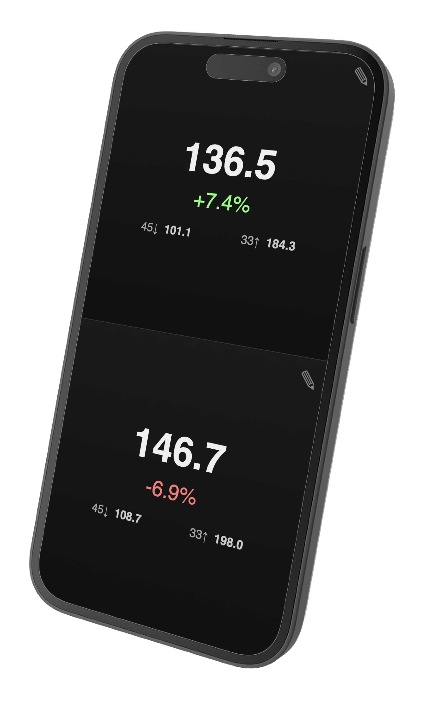

# DJTapTool 
A dual BPM counter for beatmatching vinyl DJs.

## Features
 * 2 independent BPM tap counters
 * Desktop / Mobile
 * Shows Technics-style percentage adjustments needed
 * Shows 33/45 adjustments
 * Horizonal/Landscape views
 * Manually set BPM

Rich Jones, 2025, MIT.
